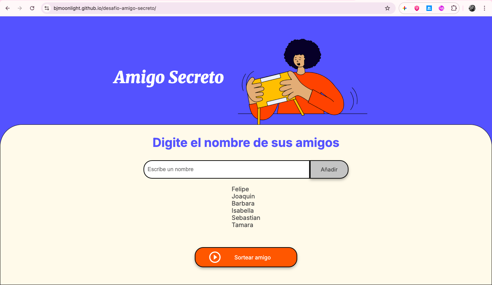
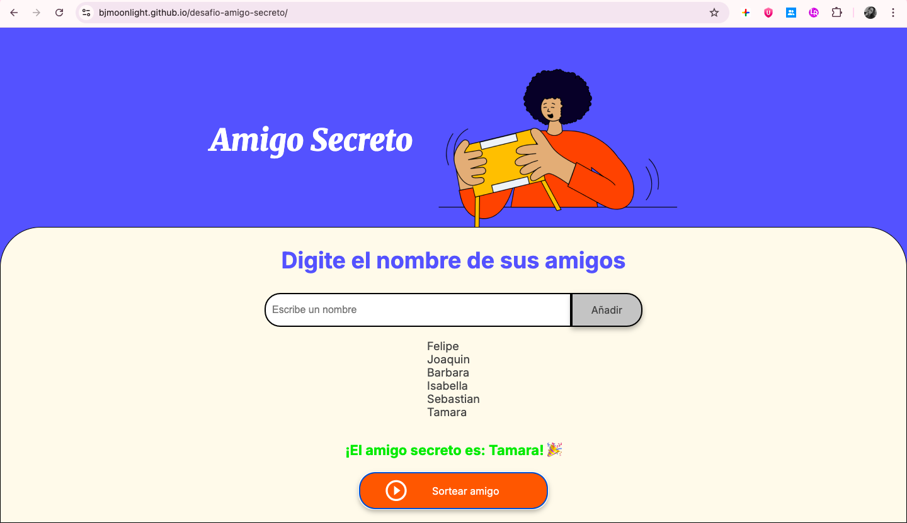

# desafio-amigo-secreto 
# Amigo Secreto

## Descripción del Proyecto
Este es un proyecto simple y divertido desarrollado con **HTML, CSS y JavaScript** que permite a un grupo de usuarios organizar un sorteo de "amigo secreto" de forma digital. La aplicación es fácil de usar: los usuarios ingresan los nombres de los participantes, y al presionar un botón, la herramienta selecciona un amigo al azar de la lista.

El objetivo principal de este desafío es practicar y demostrar habilidades en:
-   Manipulación del **DOM** (`document.getElementById`, `innerHTML`).
-   Manejo de **eventos** (`onclick`).
-   Uso de estructuras de datos (arrays) en **JavaScript**.
-   Implementación de lógica de sorteo con **`Math.random()`**.
-   Creación de una interfaz de usuario interactiva y accesible.

## Funcionalidades
-   **Agregar Nombres:** Un campo de texto y un botón "Añadir" para agregar participantes a la lista.
-   **Validación de Entrada:** Un mensaje de alerta si el usuario intenta añadir un nombre vacío.
-   **Lista Dinámica:** La lista de amigos se actualiza en tiempo real a medida que se añaden nuevos nombres.
-   **Sorteo Aleatorio:** Al hacer clic en "Sortear amigo", se elige y muestra un nombre de forma aleatoria de la lista.

## ¿Cómo Usar el Proyecto?

### Instalación y Dependencias
Este proyecto no requiere ninguna instalación o dependencia externa. Todos los archivos necesarios (`index.html`, `app.js`, `style.css`) están incluidos.

### ¿Cómo Ejecutar el Proyecto?
Para usar la aplicación, simplemente abre el archivo `index.html` en tu navegador web de preferencia. No necesitas un servidor web local, ya que todo el código se ejecuta del lado del cliente.

1.  Abre el archivo `index.html`.
2.  Ingresa los nombres de los participantes en el campo de texto.
3.  Haz clic en "Añadir" para agregarlos a la lista.
4.  Cuando la lista esté completa, haz clic en "Sortear amigo".

### Capturas de Pantalla

**1. Pantalla Inicial:**

**2. Agregando Amigos:**

**3. Resultado del Sorteo:**

---
